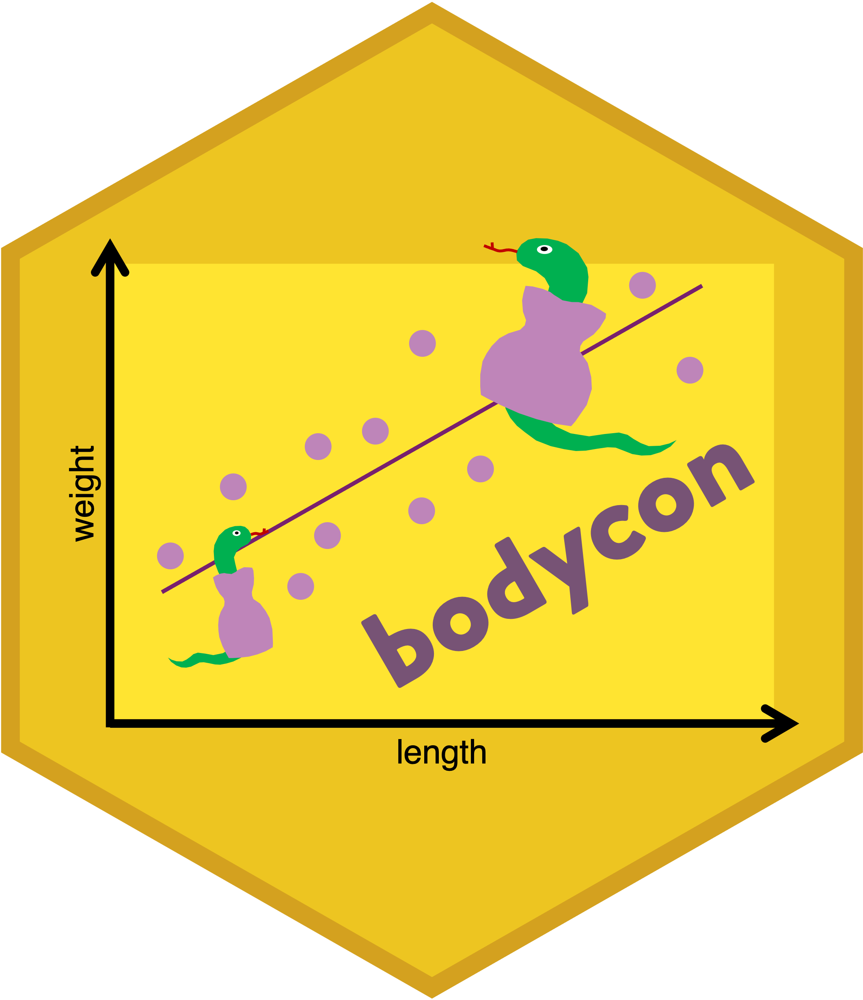

# bodycon 

<!-- badges: start -->
  [](https://github.com/julia-riley/R_package_body_condition/actions/workflows/R-CMD-check.yaml)
<!-- badges: end -->

`bodycon` is an R package for calculating commonly-used body condition indices in wildlife ecology research. In this research field, an individual's fitness traits, like reproduction and survival, are the primary metrics used to quantify an animal's health, biology, and evolution.  Yet, direct fitness measures like these can be un unfeasible to collect in the field due to financial or logistical research constraints. So, in these cases, animal ecologists often rely on proxies of individual fitness, such as body condition. One widely used method of estimating body condition is to relate body mass to a linear measure of body size, but this can be calculated in a variety of ways. This R package contains functions to for commonly-used methods of calculation of body condition indices, including residuals from an ordinary least square (OLS) regression and scaled mass body condition index (SMI) with OLS and robust regression.

**Installation**

This package is not on CRAN yet and is still under active development. At this time, there is no stable release of `bodycon`, but stay tuned. When available, you will be able to download a stable release of `bodycon `, which has full capabilities of the functions used in vignettes, by:

```{r}
remotes::install_github("julia-riley/bodycon")
```

**Getting Started**

We highly recommend taking a look at this package's vignette to get an overview of the package and how it works. You can access it here! [ADD LINK]


**Cite us to Show your Support**

If you make use of `bodycon`, please make sure to cite it.
```{r}
citation("bodycon")
```

**Find a Bug?**

Thank you for catching it! Head over to the GitHub Issues tab and let us know about it. We will try to get to it as soon as we can.
