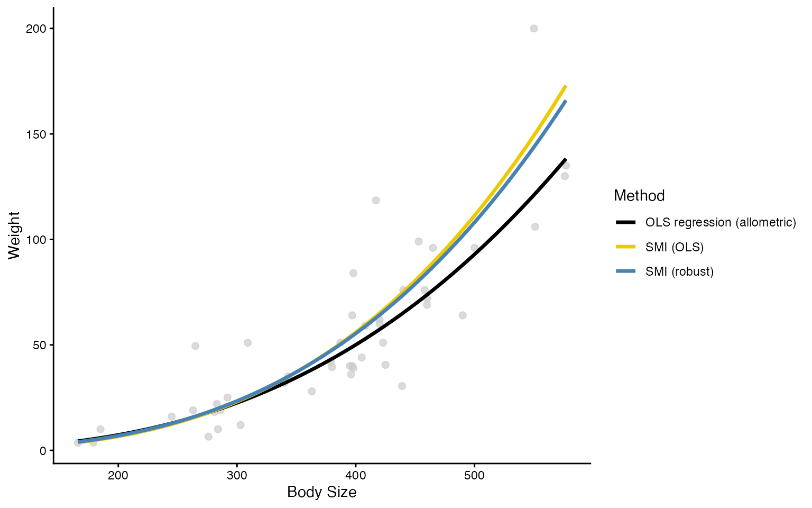
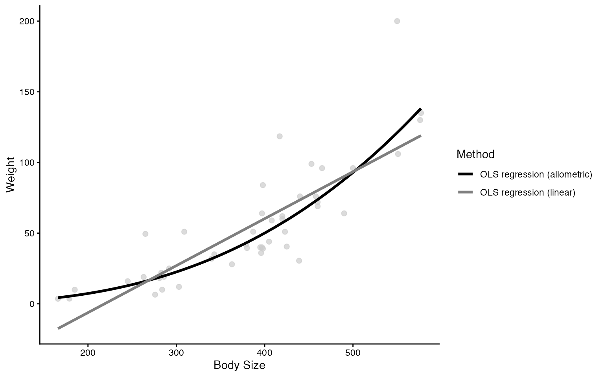
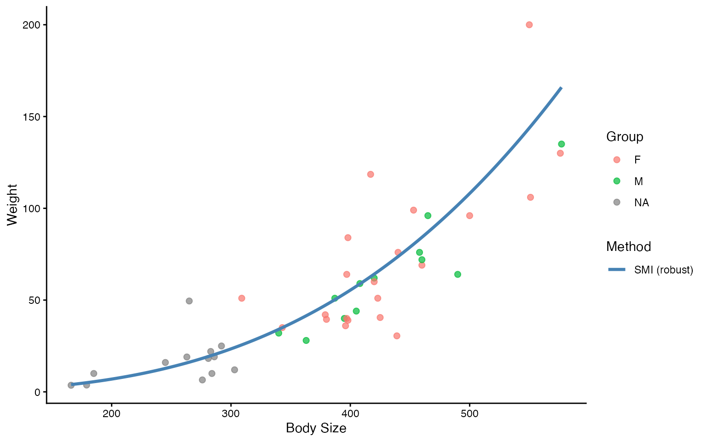
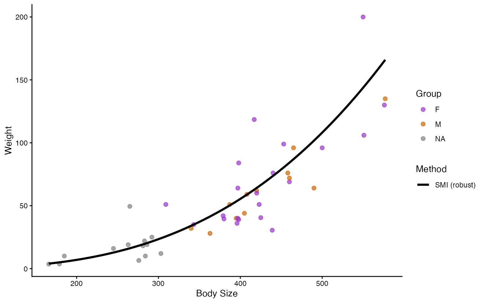

# bodycon Quick Start Guide


*bodycon* is an R package for calculating commonly used body condition
indices in wildlife ecology. Body condition is often used as a proxy for
individual health and energetic reserves when direct measures of
fitness, like survival or reproductive success, are difficult to obtain.
This package provides functions for calculating several widely used body
condition indices from measurements of animal body size and mass, with
tools for comparing methods and visualising results. We hope to continue
to develop `bodycon` to expand the taxa and approaches to which it can
be applied.

## Installation

#### Install from CRAN

If you are installing the released version of `bodycon` from CRAN:

``` r

install.packages("bodycon")
```

#### Install the development version

To install the development version from GitHub:

``` r

install.packages("remotes")
remotes::install_github("julia-riley/bodycon")
```

#### Load `bodycon`

Once installed, load the package:

``` r

library(bodycon)
```

## Example Datasets

Two example datasets are included with `bodycon` to demonstrate the
function in the package.

#### `gartersnake`

The `gartersnake` dataset contains morphological measurements of 46
Maritime Gartersnakes (*Thamnophis sirtalis pallidulus*) collected in
New Brunswick and Nova Scotia, Canada during summer 2022. The dataset
includes measurements of body size and mass that can be used to
calculate body condition indices. The body size measurement is
snout-vent length (SVL), which is the distance from the snake’s snout to
the anterior edge of their cloaca and was recorded in mm. The weight
measure is mass (g).

You can view the structure of the `gartersnake` dataset using:

``` r

dplyr::glimpse(gartersnake)
#> Rows: 46
#> Columns: 6
#> $ id_num          <dbl> 1, 3, 4, 5, 6, 7, 8, 9, 10, 11, 12, 13, 14, 16, 18, 19…
#> $ age_class       <chr> "J", "J", "A", "A", "J", "J", "A", "A", "J", "J", "A",…
#> $ sex             <chr> NA, NA, "F", "F", NA, NA, "F", "F", NA, NA, "M", NA, "…
#> $ mass_g          <dbl> 3.71, 3.59, 35.00, 39.50, 18.20, 19.10, 118.50, 51.00,…
#> $ svl_mm          <dbl> 179, 166, 343, 380, 281, 286, 417, 309, 284, 303, 387,…
#> $ total_length_mm <dbl> 220.0, 208.0, 421.0, 485.0, 370.0, 304.5, 552.5, 410.0…
```

#### `salamander`

The `salamander` dataset contains morphological measurements from 128
Eastern Red-backed Salamanders (*Plethodon cinereus*) collected in New
Brunswick, Canada in the summer of 2022. The dataset includes
measurement of size (SVL in mm) and mass data for each individual
salamander that can be used to calculate body condition indices.

You can view the structure of the `salamander` dataset using:

``` r

dplyr::glimpse(salamander)
#> Rows: 128
#> Columns: 8
#> $ salamander_ID   <chr> "J1002", "J1005", "J1009", "J1011", "J1015", "J1016", …
#> $ sex             <chr> "F", "F", "F", "F", "F", "F", "F", "J", "M", "F", "F",…
#> $ morph           <chr> "RB", "RB", "RB", "RB", "RB", "RB", "RB", "RB", "RB", …
#> $ gravid          <chr> "n", "n", "n", "n", "n", "n", "n", "n", "n", "n", "n",…
#> $ age             <chr> "A", "A", "A", "A", "A", "A", "A", "J", "A", "A", "A",…
#> $ mass_g          <dbl> 0.50, 0.47, 1.13, 0.84, 0.63, 0.63, 0.86, 0.19, 0.86, …
#> $ svl_mm          <dbl> 34.87, 34.98, 41.79, 38.53, 35.04, 31.76, 39.27, 24.22…
#> $ total_length_mm <dbl> 74.77, 65.62, 85.55, 79.76, 75.06, 66.32, 78.73, 43.28…
```

## Calculation of body condition indexes

The `bodycon` package provides several function for calculating body
condition indices from measurements of animal body size and mass. The
[`bci()`](https://julia-riley.github.io/bodycon/reference/bci.md)
function can be used to calculate indices using one or more methods,
while seperate functions are also availiable for each method. The
package currently includes three methods: OLS residuals, SMI using OLS
regression, and SMI using robust regression. All methods require a
standardised measure of body size (i.e., tarsus length for birds or
snout-vent length for reptiles) and a measure of body mass.

### Residuals from ordinary least squares regression

This residual method estimates body condition indices from the residuals
of an ordinary least squares regression (OLS). This is a traditional
approach in ecology (Krebs and Singleton 1993). The method is specified
as `"resid_ols"`, and see the examples below of using it to calculate
body condition of gartersnakes:

``` r

bci_resid_ols(gartersnake, svl_mm, mass_g)
#> # A tibble: 46 × 1
#>    resid_allometric
#>               <dbl>
#>  1          -0.372 
#>  2          -0.196 
#>  3           0.0686
#>  4          -0.0945
#>  5          -0.0324
#>  6          -0.0331
#>  7           0.746 
#>  8           0.735 
#>  9          -0.661 
#> 10          -0.658 
#> # ℹ 36 more rows
```

All bodycon functions can also be used with the native R pipe `(|>)`.
For example, `gartersnake |> bci_resid_ols(svl_mm, mass_g)` is
equivalent to the example above.

By default,
[`bci_resid_ols()`](https://julia-riley.github.io/bodycon/reference/bci_resid_ols.md)
assumes an allometric relationship between body size and mass, with both
variables log-transformed before the OLS regression is fitted. This is a
common approach for modelling the relationship between body size and
mass, but the choice of relationship should be evaluated for the data
and species being studied.

You can instead specify `relation = "linear"` to fit the relationship
using the untransformed measurements. However, this assumes that mass
increases linearly with body size. Because a linear relationship may not
adequately describe the relationship between body size and mass, we
recommend examining the data and fitted relationship before choosing
this option.

### Scaled mass index (SMI)

Residual-based body condition indices have been widely used in ecology,
but their use has been critqued. Concerns include the statistical
assumptions of residual-based approached (García-Berthou, 2001), their
sensitivty to methodological choices (Schulte-Hostedde et al., 2005;
Peig and Green, 2009), and whether their appropriateness varies among
taxa (Jakob et al., 1996; Băncilă et al., 2010; Labocha and Hayes,
2012). The scaled mass index (SMI) provides an alternative approach for
estimating body conition that was developed by Peig and Green (2009).

The SMI estimates expected body mass at a standardized body size based
on the scaling relationship between body size and mass. In `bodycon`,
SMI can be calculated using either ordinary least squares regression
([`bci_smi_ols()`](https://julia-riley.github.io/bodycon/reference/bci_smi_ols.md))
or robust regression (`bci_smi-rob()`). The standard SMI approach
assumes an allometric relationship between body size and mass, so both
measurements are log-transformed before the relationship is estimated.

#### SMI using ordinary least squares regression

The `bci_smi_ols` functions calculates SMI using ordinary least squares
regression. For example, using this fuction we can calculate this for
the `salamander` dataset using:

``` r


bci_smi_ols(salamander, svl_mm, mass_g)
#> # A tibble: 128 × 1
#>    smi_ols
#>      <dbl>
#>  1   0.459
#>  2   0.427
#>  3   0.611
#>  4   0.576
#>  5   0.570
#>  6   0.760
#>  7   0.558
#>  8   0.506
#>  9   0.532
#> 10   0.626
#> # ℹ 118 more rows
```

SMIT estimation using OLS can be sensitive to outliers (i.e., data
points that may distort the expected relationship between body length
and mass). This can have a strong influence on the estimated
relationship between body size and mass. When outliers are present,
robust regression provides an alternative approach to estimating SMI
using the
[`bci_smi_rob()`](https://julia-riley.github.io/bodycon/reference/bci_smi_rob.md)
function.

#### SMI using robust regression

The
[`bci_smi_rob()`](https://julia-riley.github.io/bodycon/reference/bci_smi_rob.md)
function calculates the SMI using robust regression. The function uses
an M estimator from the `MASS` package (Venables and Ripley, 2002),
which reduces the influence of outliers when estimating the relationship
between body size and mass. This approach is based on this [R code by
Chen-Pan
Liao](https://apansharing.blogspot.com/2018/05/an-r-function-olsrobust-caled-mass-index.html).

For example, SMI can be caculated using robust regression for the
`salamander` dataset:

``` r


bci_smi_rob(salamander, svl_mm, mass_g)
#> # A tibble: 128 × 1
#>    smi_rob
#>      <dbl>
#>  1   0.458
#>  2   0.427
#>  3   0.606
#>  4   0.573
#>  5   0.569
#>  6   0.762
#>  7   0.554
#>  8   0.513
#>  9   0.528
#> 10   0.622
#> # ℹ 118 more rows
```

Robust regression can be useful when outliers are present and may
disproportionately influence the estimated relationship between body
size and mass.

### Using multiple methods at once

The [`bci()`](https://julia-riley.github.io/bodycon/reference/bci.md)
function allows you to calculate body condition indices using multiple
methods at once. This can be used fil when you want to compare how
estimates of body condition differ among methods.

For example, you can calculate indices using the residual OLS, SMI OLS,
and SMI robust regression methods:

``` r


bci(gartersnake, svl_mm, mass_g, 
    method = c("resid_ols", "smi_ols", "smi_rob"),
    relation = c("linear", "allometric"))
#> Warning: The 'linear' relation applies only to the OLS residual method; SMI
#> methods always use allometric (log-log) scaling.
#> Warning: OLS residual method used a linear (non-log) relationship. This assumes
#> a linear relationship between body size and mass.
#> # A tibble: 46 × 4
#>    resid_linear resid_allometric smi_ols smi_rob
#>           <dbl>            <dbl>   <dbl>   <dbl>
#>  1        16.9           -0.372     38.0    35.6
#>  2        21.1           -0.196     46.4    43.2
#>  3        -6.29           0.0686    48.4    47.9
#>  4       -14.1           -0.0945    39.8    39.8
#>  5        -2.49          -0.0324    46.5    45.3
#>  6        -3.25          -0.0331    46.2    45.1
#>  7        52.6            0.746     89.8    90.4
#>  8        21.0            0.735     97.2    95.5
#>  9       -11.7           -0.661     24.7    24.1
#> 10       -16.0           -0.658     24.3    23.8
#> # ℹ 36 more rows
```

The `relation` argument specifies whether the residual OLS method should
use a linear or allometric relationship. The SMI methods always use an
allometric relationship.

### Including individual identifiers

If your dataset contained a unique identifier for each individual, you
can include it using the `id` argument. This adds the identifier to the
output, making it easier to match body condition estimates to individual
animals.

For example:

``` r


bci(gartersnake, svl_mm, mass_g,
    id = id_num,
    method = c("resid_ols", "smi_ols", "smi_rob"))
#> # A tibble: 46 × 4
#>       id resid_allometric smi_ols smi_rob
#>    <dbl>            <dbl>   <dbl>   <dbl>
#>  1     1          -0.372     38.0    35.6
#>  2     3          -0.196     46.4    43.2
#>  3     4           0.0686    48.4    47.9
#>  4     5          -0.0945    39.8    39.8
#>  5     6          -0.0324    46.5    45.3
#>  6     7          -0.0331    46.2    45.1
#>  7     8           0.746     89.8    90.4
#>  8     9           0.735     97.2    95.5
#>  9    10          -0.661     24.7    24.1
#> 10    11          -0.658     24.3    23.8
#> # ℹ 36 more rows
```

## Visual comparison of body condition indices

Visualising body condition indices alongside the observed relationship
between body size and mass can help you compare methods and assess
whether the assumptions of different approaches are appropriate for your
data. These plots should be considered alongside the relevant literature
and the goals of your analyses when selecting a body condition index.

The
[`plot_bci()`](https://julia-riley.github.io/bodycon/reference/plot_bci.md)
function allows you to visualise:

- OLS residuals (resid_ols)
- Scaled Mass Index using ordinary least squares regression (smi_ols)
- Scaled Mass Index using robust regression (smi_rob)

Raw data can also be grouped (e.g., by sex or population), and colours
can be customized for both raw points and fitted method lines.

#### Comparing body condition methods

The simplest approach is to plot multiple body condition methods
together:

``` r

plot_bci(
   gartersnake,
   svl_mm,
   mass_g,
   method = c("resid_ols", "smi_ols", "smi_rob")
   )
```



#### Comparing linear and allometric relationships

You can also use `plot_bci` to compare linear vs. allometric
relationships between body size and mass. This can be useful when
evaluating whether the assumptions of the residual OLS method are
appropriate for your data.

``` r

plot_bci(
   gartersnake,
   svl_mm,
   mass_g,
   method = c("resid_ols"),
   relation = c("linear", "allometric")
   )
```



#### Grouping and customising plots

The `group` argument allows you to highlight groups within the raw data.
For example, you can separate male and female gartersnakes when plotting
the SMI using robust regression:

``` r

plot_bci(
   gartersnake,
   svl_mm,
   mass_g,
   method = c("smi_rob"),
   group = sex
   )
```



Colours for raw data groups and method lines can be customised using
`group_colours` and `method_colours`.

``` r

plot_bci(
   gartersnake,
   svl_mm,
   mass_g,
   method = c("smi_rob"),
   group = sex,
   group_colours = c("M" = "darkorange3", "F" = "darkorchid"),
   method_colours = c("SMI (robust)" = "black")
)
```



You can also adjust the labels, presence of a legend, and, in addition
to plotting the graph, return the predictions so you can customise a
figure further on your own. Check our the documentation for this
function using
[`?plot_bci`](https://julia-riley.github.io/bodycon/reference/plot_bci.md)
for details on all available arguments.

## References

Băncilă RI, Hartel T, Plăiaşu R, Smets J, and Cogălniceanu D. (2010)
Comparing three body condition indices in amphibians: a case study of
yellow-bellied toad *Bombina variegata*. Amphibia-Reptilia, 31(4),
558-562.

García-Berthou E. (2001) On the misuse of residuals in ecology: testing
regression residuals vs. the analysis of covariance. Journal of Animal
Ecology, 70(4), 708-711.

Jakob EM, Marshall SD, and Uetz GW. (1996) Estimating fitness: a
comparison of body condition indices. Oikos, 77, 61-67.

Krebs CJ, and Singleton GR. (1993) Indexes of condition for small
mammals. Australian Journal of Zoology, 41(4), 317-323.

Labocha MK, and Hayes JP. (2012) Morphometric indices of body condition
in birds: a review. Journal of Ornithology, 153(1), 1-22.

Peig J, and Green AJ. (2009) New perspectives for estimating body
condition from mass/length data: the scaled mass index as an alternative
method. Oikos, 118(12), 1883-1891.

Schulte-Hostedde AI, Zinner B, Millar JS, and Hickling GJ. (2005)
Restitution of mass–size residuals: validating body condition indices.
Ecology, 86(1), 155-163.

Ripley BD, and Venables WN. (2002). Modern Applied Statistics with S,
Fourth edition. Springer, New York. ISBN 0-387-95457-0,
<https://www.stats.ox.ac.uk/pub/MASS4/>.
