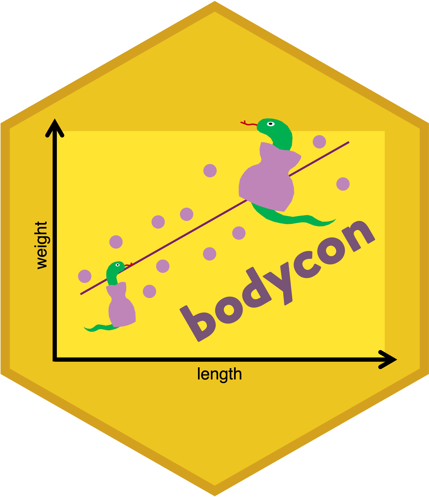

```{r, include = FALSE}
knitr::opts_chunk$set(
  collapse = TRUE,
  comment = "#>",
  fig.width = 8,
  fig.height = 5,
  out.width = "100%"
)
```

<div class="bodycon-intro" style="display: flex; align-items: flex-start; gap: 25px;">
<div class="bodycon-vignette-header">

</div>
<div class="bodycon-intro-text">
<em>bodycon</em> is an R package for calculating commonly used body condition indices in wildlife ecology. Body condition is often used as a proxy for individual health and energetic reserves when direct measures of fitness, like survival or reproductive success, are difficult to obtain. This package provides functions for calculating several widely used body condition indices from measurements of animal body size and mass, with tools for comparing methods and visualising results. We hope to continue to develop <code>bodycon</code> to expand the taxa and approaches to which it can be applied.
</div>
</div>

# Installation

### Install from CRAN

If you are installing the released version of `bodycon` from CRAN:
```{r, eval = FALSE}
install.packages("bodycon")
```

### Install the development version

To install the development version from GitHub:
```{r, eval = FALSE}
install.packages("remotes")
remotes::install_github("julia-riley/bodycon")
```

### Load `bodycon`

Once installed, load the package:
```{r}
library(bodycon)
```


# Example datasets

Two example datasets are included with `bodycon` to demonstrate the functions in the package.

### `gartersnake`

The `gartersnake` dataset contains morphological measurements of 46 Maritime Gartersnakes (*Thamnophis sirtalis pallidulus*) collected in New Brunswick and Nova Scotia, Canada during summer 2022. The dataset includes measurements of body size and mass that can be used to calculate body condition indices. The body size measurement is snout-vent length (SVL), which is the distance from the snake's snout to the anterior edge of their cloaca and was recorded in mm. The weight measure is mass (g).

You can view the structure of the `gartersnake` dataset using:
```{r}
dplyr::glimpse(gartersnake)
```

### `salamander`

The `salamander` dataset contains morphological measurements from 128 Eastern Red-backed Salamanders (*Plethodon cinereus*) collected in New Brunswick, Canada in the summer of 2022. The dataset includes measurements of size (SVL in mm) and mass (g) data for each individual salamander that can be used to calculate body condition indices.

You can view the structure of the `salamander` dataset using:
```{r}
dplyr::glimpse(salamander)
```


# Calculation of body condition indices

The `bodycon` package provides several functions for calculating body condition indices from measurements of animal body size and mass. The `bci()` function can be used to calculate indices using one or more methods, while separate functions are also available for each method. The package currently includes three methods: OLS residuals, the scaled mass index (SMI) using standardised major axis (SMA) regression, and the SMI using robust SMA regression. All methods require a standardised measure of body size (i.e., tarsus length for birds or snout-vent length for squamates) and a measure of body mass. 

## Residuals from ordinary least squares regression

The `bci_resid_ols()` function estimates body condition indices from the residuals of an ordinary least squares regression (OLS). This is a traditional approach in ecology (Krebs and Singleton 1993). For example, body condition can be calculated using this method for the `gartersnake` dataset using:

```{r}
bci_resid_ols(gartersnake, svl_mm, mass_g)
```

All bodycon functions can also be used with the native R pipe `(|>)`. For example, `gartersnake |> bci_resid_ols(svl_mm, mass_g)` is equivalent to the example above.

By default, `bci_resid_ols()` assumes an allometric relationship between body size and mass, with both variables log-transformed before the OLS regression is fitted. This is a common approach for modelling the relationship between body size and mass, but the choice of relationship should be evaluated for the data and species being studied.

You can instead specify `relation = "linear"` to fit the relationship using the untransformed measurements. However, this assumes that mass increases linearly with body size. Because a linear relationship may not adequately describe the relationship between body size and mass, we recommend examining the data and fitted relationship before choosing this option.

## Scaled mass index (SMI)

Residual-based body condition indices have been widely used in ecology, but their use has been critiqued. Concerns include the statistical assumptions of residual-based approaches (García-Berthou, 2001), their sensitivity to methodological choices (Schulte-Hostedde et al., 2005; Peig and Green, 2009), and that their appropriateness varies among taxa (Jakob et al., 1996; Băncilă et al., 2010; Labocha and Hayes, 2012). The scaled mass index (SMI) provides an alternative approach for estimating body condition that was developed by Peig and Green (2009).

The SMI estimates expected body mass at a standardised body size based on the scaling relationship between body size and mass. In `bodycon`, the SMI method estimates the scaling exponent using standardised major axis (SMA) regression, while the robust SMI method estimates the scaling exponent using robust SMA regression. The SMI approach assumes an allometric relationship between body size and mass, so both measurements are log-transformed before the scaling relationship is estimated.

### SMI using standardised major axis regression

The `bci_smi()` function calculates SMI using standardised major axis (SMA) regression. For example, we can calculate SMI for the `salamander` dataset using: 

```{r}

bci_smi(salamander, svl_mm, mass_g)

```

SMI estimation using SMA can be sensitive to outliers (i.e., data points that may distort the expected relationship between body length and mass). These outliers can have a strong influence on the estimated relationship between body size and mass. When outliers are present, robust SMA regression provides an alternative approach to estimating SMI.


### SMI using robust standardised major axis regression

The `bci_smi_rob()` function calculates SMI using robust standardised major axis (SMA) regression. This approach reduces the influence of potential outliers when estimating the relationship between body size and mass.

For example, SMI can be calculated using robust SMA regression for the `salamander` dataset:

```{r}

bci_smi_rob(salamander, svl_mm, mass_g)

```

Robust SMA regression can be useful when outliers are present that may disproportionately influence the estimated relationship between body size and mass.


## Using multiple methods at once

The `bci()` function allows you to calculate body condition indices using multiple methods at once. This can be useful when you want to compare how estimates of body condition differ among methods. 

For example, you can use the `method` argument to specify the methods to include, like residual OLS (`"resid_ols"`), SMI (`"smi"`), and robust SMI (`"smi_rob"`): 

```{r}

bci(gartersnake, svl_mm, mass_g, 
    method = c("resid_ols", "smi", "smi_rob"),
    relation = c("linear", "allometric"))

```

The `relation` argument specifies whether the residual OLS method should use a linear or allometric relationship. The SMI methods always use an allometric relationship. Thus, in the example above, both linear and allometric OLS residual indices are calculated, while the two SMI methods are calculated using their respective SMA scaling exponents.


## Including individual identifiers

If your dataset contains a unique identifier for each individual, you can include it using the `id` argument. This adds the identifier to the output, making it easier to match body condition estimates to individual animals. 

For example, the `id` argument can be used to include the `id_num` variable from the `gartersnake` dataset in the output:

```{r}

bci(gartersnake, svl_mm, mass_g,
    id = id_num,
    method = c("resid_ols", "smi", "smi_rob"))

```


# Visual comparison of body condition indices

Visualising body condition indices alongside the observed relationship between body size and mass can help you compare methods and assess whether the assumptions of different approaches are appropriate for your data. These plots should be considered alongside the relevant literature and the goals of your analyses when selecting a body condition index.

The `plot_bci()` function allows you to visualise:

+ OLS residuals (`"resid_ols"`)
+ Scaled Mass Index using standardised major axis (SMA) regression (`"smi"`)
+ Scaled Mass Index using robust SMA regression (`"smi_rob"`)

Raw data can also be grouped (e.g., by sex or population), and colours can be customized for both raw points and reference relationships.

### Comparing body condition methods

The simplest approach is to plot multiple body condition methods together:

```{r}
plot_bci(
   gartersnake,
   svl_mm,
   mass_g,
   method = c("resid_ols", "smi", "smi_rob")
   )
```

### Comparing linear and allometric relationships

You can also use `plot_bci()` to compare linear versus allometric relationships between body size and mass. This can be useful when evaluating whether the assumptions of the residual OLS method are appropriate for your data. 

```{r}
plot_bci(
   gartersnake,
   svl_mm,
   mass_g,
   method = c("resid_ols"),
   relation = c("linear", "allometric")
   )
```


### Grouping and customising plots

The `group` argument allows you to highlight groups within the raw data. For example, you can separate male and female gartersnakes when plotting raw data and SMI using robust SMA regression:

```{r}  
plot_bci(
   gartersnake,
   svl_mm,
   mass_g,
   method = c("smi_rob"),
   group = sex
   )
```

Colours for raw data groups and reference relationships can be customised using `group_colours` and `method_colours`.

```{r}  
plot_bci(
   gartersnake,
   svl_mm,
   mass_g,
   method = c("smi_rob"),
   group = sex,
   group_colours = c("M" = "darkorange3", "F" = "darkorchid"),
   method_colours = c("SMI (robust)" = "black")
)
```

You can also adjust the labels, presence of a legend, and, in addition to plotting the graph, return the predictions so you can customise a figure further on your own. Check out the documentation for this function using `?plot_bci()` for details on all available arguments.


# References

Băncilă RI, Hartel T, Plăiaşu R, Smets J, and Cogălniceanu D. (2010) Comparing three body condition indices in amphibians: a case study of yellow-bellied toad *Bombina variegata*. Amphibia-Reptilia, 31(4), 558-562.

García-Berthou E. (2001) On the misuse of residuals in ecology: testing regression residuals vs. the analysis of covariance. Journal of Animal Ecology, 70(4), 708-711.

Jakob EM, Marshall SD, and Uetz GW. (1996) Estimating fitness: a comparison of body condition indices. Oikos, 77, 61-67.

Krebs CJ, and Singleton GR. (1993) Indexes of condition for small mammals. Australian Journal of Zoology, 41(4), 317-323.

Labocha MK, and Hayes JP. (2012) Morphometric indices of body condition in birds: a review. Journal of Ornithology, 153(1), 1-22.

Peig J, and Green AJ. (2009) New perspectives for estimating body condition from mass/length data: the scaled mass index as an alternative method. Oikos, 118(12), 1883-1891.

Schulte-Hostedde AI, Zinner B, Millar JS, and Hickling GJ. (2005) Restitution of mass–size residuals: validating body condition indices. Ecology, 86(1), 155-163.
